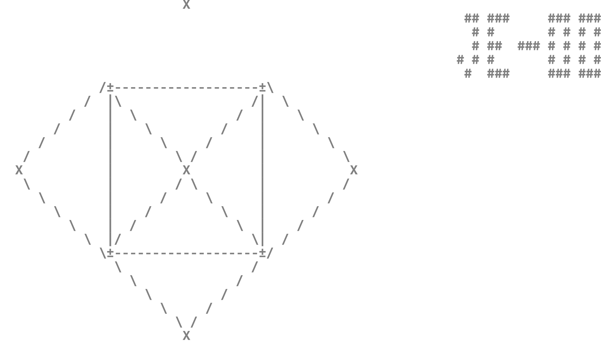

# Hello, I'm [José](https://www.linkedin.com/in/jose-esquerra/) - aka JE-00 *(He/His - Él)*

## I'm a mexican Student at the [Tecnológico de Monterrey](https://github.com/tecnologico-de-monterrey-oficial), Developer and Cybersecurity Trainee!

### Connect with me:

- [**Website** (Comming soon)](https://www.joseesquerra.com)

- [**LinkedIn**](https://www.linkedin.com/in/jose-esquerra/)

- [**Twitter**](https://twitter.com/jose_esquerra)

- [Check out **Cybersecurity TEC**!](https://linktr.ee/cybersecurity.mty)

---
## About me

- I am part of the [Leaders of Tomorrow](http://lideresdelmanana.itesm.mx/) scholarship
- 🔭 I’m currently working on [Cybersecurity TEC](https://linktr.ee/cybersecurity.mty) as Director of Social Responsibility
- 🌱 I’m currently learning social engineering, networking and hacking
- 👯 I’m looking to collaborate on open source projects and bughunting
- 🤔 I’m looking for help with web development wit a social project for [Cybersecurity TEC](https://linktr.ee/cybersecurity.mty)
- 💬 Ask me about my projects and plans, let's see how we can collaborate
- 📫 How to reach me: <joseesquerra@protonmail.com>

----

- 😄 Soft skills:
  -  Analysis and solution of problems
  -  Lead and evaluate others
  -  Empathy and flexibility
  -  Support and teamwork
  -  Structure and order
- 👨🏻‍💻 Technical skills:
  -  C++
  -  Python
  -  Databases
  -  Web Development
  -  Linux

---

- ⚡ Fun fact: My favorite food is molletes and my least favorite food is picadillo.
- 🥅 2022 Goals: Learn more about incident response and networking.

---
## [My projects](https://github.com/stars/JE-00/lists/my-favorites)
---

## Analytics

